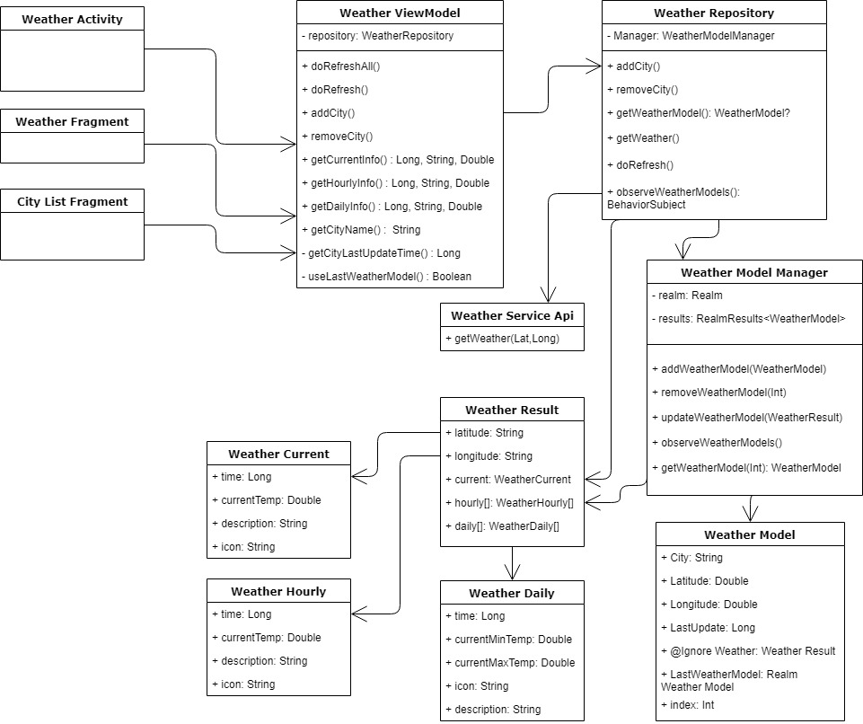

# Weather App

A weather app utilizing Dark Sky API, and Google Places to query a city's weather based on it's latitude and longitude. Google Places returns the city's latitude and longitude. Dark Sky uses the queried lat/long.

## Architecture

## Authors

* **Joshua Herrera** 

## License

This project is licensed under the MIT License - see the [LICENSE.md](LICENSE.md) file for details

## Acknowledgments

* https://square.github.io/retrofit/
* https://github.com/erikflowers/weather-icons
* https://developers.google.com/places/android-sdk/autocomplete
